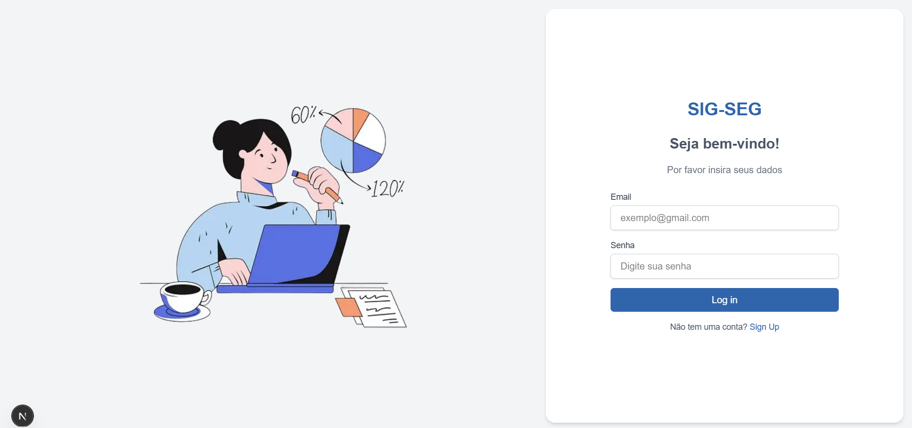
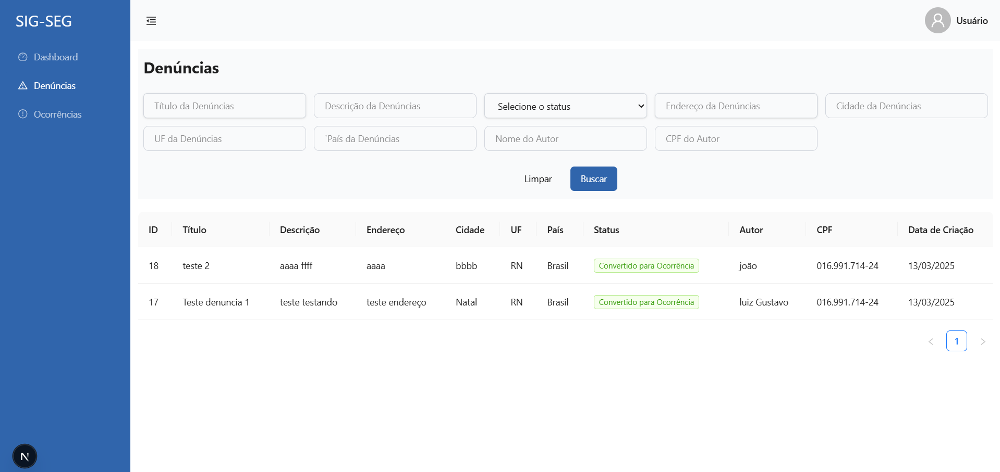

## sigsegfront

# Autor

Luiz Gustavo da Silva

## Descrição

Projeto SIG-SEG (Sistema de Informação Gerencial para Secretaria de Segurança), feito para o cumprimento do desafio.

## Tecnologias

- Next js
- NextAuth
- Ant design

## Como baixar e executar o projeto

### Passos para rodar o projeto

1. **Clone o repositório**  

   git clone https://github.com/Luiz-gustavo-da-silva/sigsegfront

2. **Instale as dependências**

    Navegue até o diretório do projeto e instale as dependências utilizando o comando:

    cd sigsegfront
    npm install

3. **Configure o next-auth**

    npx auth secret

4. **Execute o projeto**
    
    Agora, você pode rodar o projeto localmente com o comando:

    npm run dev

    Isso iniciará o servidor de desenvolvimento. O projeto estará disponível em http://localhost:3000.

## Telas do Sistema

## Públicas

## Privadas
 

# Vídeo com demonstração

https://drive.google.com/file/d/1E8YJd2j7ZT5mfNwFWAVWjOBa5qPKe8Z3/view?usp=sharing